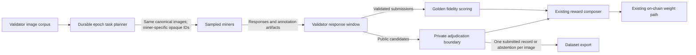

# Annotation Validator Architecture

Validators curate useful miner contributions across rounds. They score submitted work against a hidden labeled sample, select public-image annotations for export, and reward both fidelity and selected contributions.

## Round flow

## Task and data boundaries

- An epoch planner creates tasks of up to 30 distinct images and apportions the epoch's hidden golden set across those tasks. Public images occur once in the epoch plan.
- The validator persists the epoch seed, plan, and cursor. Restarting resumes that plan rather than assigning an image twice or skipping ahead.
- Every sampled miner receives the same canonical images for a task, with IDs that are opaque and unique to that miner. Miner payloads do not reveal golden membership or labels.
- Each task has one 600-second monotonic miner window beginning at dispatch. It covers miner responses, artifact retrieval, and schema validation. Timeout, invalid data, or a late result is an abstention. The validator closes each task once.
- Adjudication happens after the miner window; its elapsed time is reported separately. Public output is either one complete submitted miner record or unassigned. A selected record is not treated as human ground-truth verified.

## Scoring, selection, and export

The existing fidelity scorer remains responsible for golden-set scoring. Public annotations pass through a narrow typed boundary to validator-only adjudication logic. Export and reward code consume the selected source record and keep fidelity separate from selected-image contribution. The existing alpha configuration and on-chain weight calculation remain in place.

There is no legacy consensus substitute for public-image adjudication. If adjudication is unavailable or fails, affected images remain unassigned and the validator records the failure.

## Local verification boundaries

Local verification uses a fresh loopback chain, isolated wallet and state directories, and a local artifact destination. The dataset manifest and cached images are read-only inputs. A local run must not source arbitrary staging configuration or write miner annotations or commercial exports to the production dataset bucket.

The vision checkpoint must be an operator-approved local visual model with a pinned revision. The evaluator's private implementation details are intentionally outside this architecture document.
